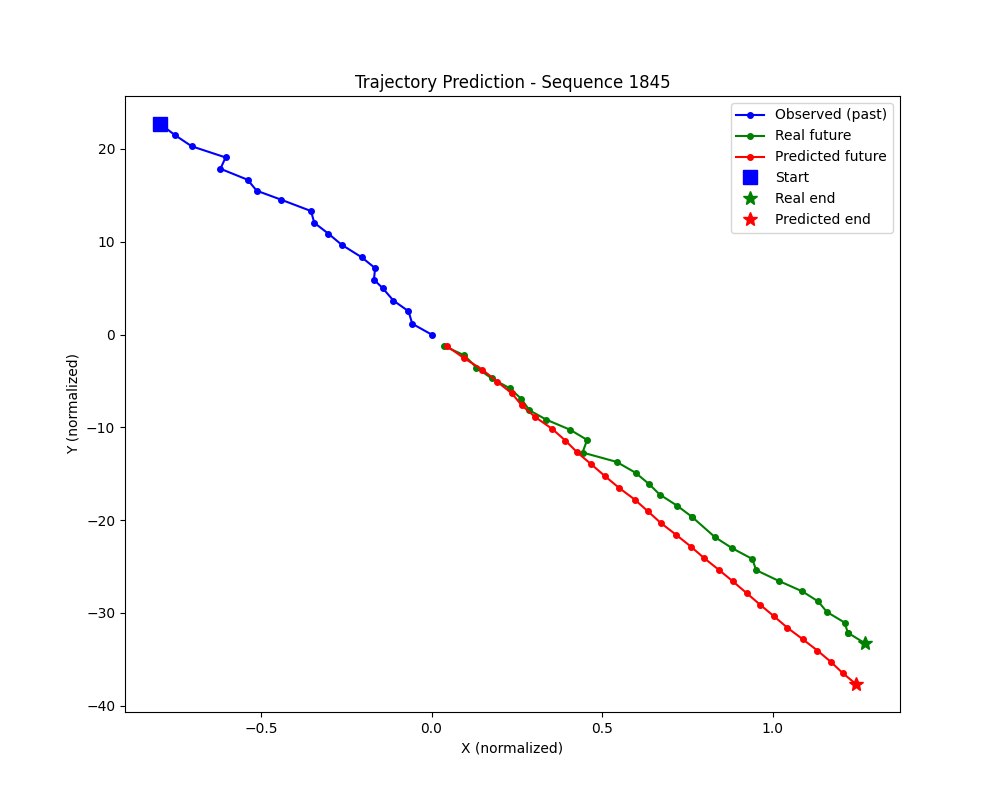
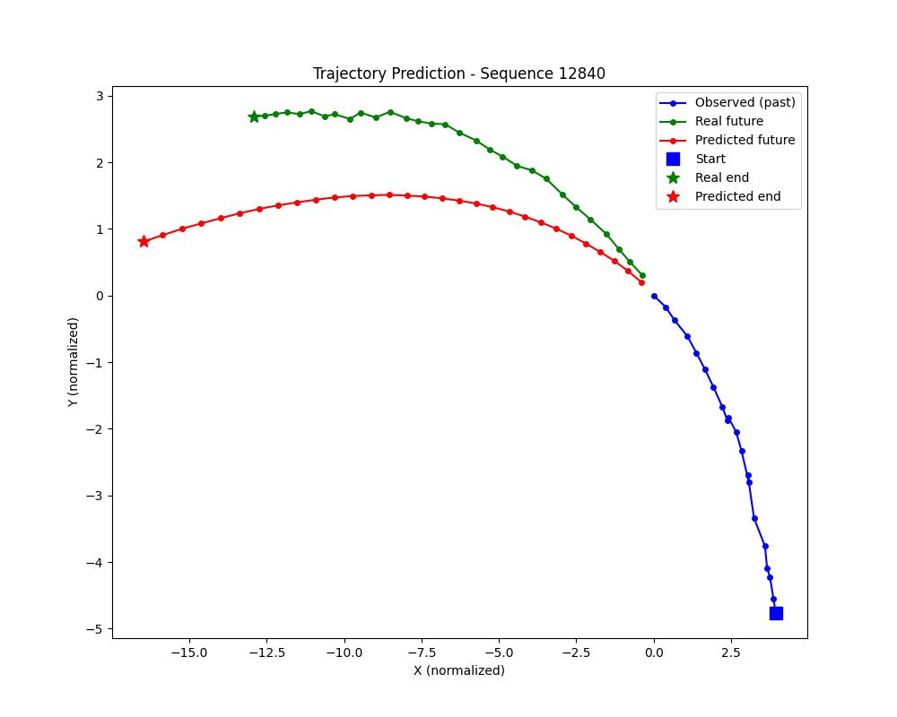

# Argoverse Trajectory Prediction

A driving trajectory prediction system using GNN + Transformer architecture, trained on the Argoverse Motion Forecasting dataset.

## Overview
Given 2 seconds of a vehicle's past trajectory and surrounding agents, predict the next 3 seconds of movement.

## Live Demo
🚀 [Try the interactive demo here](https://argoverse-trajectory-prediction-zkr8gjpuu4jlfxxlnch9mg.streamlit.app/)

## Architecture
- **GNN (Graph Neural Network)** — models interactions between surrounding vehicles
- **Transformer** — captures temporal patterns to predict future trajectory

## Dataset
- Argoverse Motion Forecasting dataset
- 205,942 training sequences
- 39,427 validation sequences

## Results
| Model | ADE (m) | FDE (m) |
|-------|---------|---------|
| Small (hidden=64) | 2.17 | 4.78 |
| Large (hidden=128) | 2.08 | 4.54 |

## Example Predictions

### Good prediction (straight line)


### Curved trajectory


## Project Structure
- `preprocess_fn.py` — data preprocessing pipeline
- `preprocess_val.py` — preprocess validation data
- `save_data.py` — preprocess and save full dataset
- `model.py` — GNN + Transformer model architecture
- `train.py` — training loop with MLflow tracking
- `evaluate.py` — evaluation with ADE/FDE metrics
- `visualize.py` — trajectory visualization
- `app.py` — Streamlit interactive demo

## Setup
```bash
pip install -r requirements.txt
python save_data.py
python train.py
python evaluate.py
streamlit run app.py
```

## Tech Stack
- PyTorch
- PyTorch Geometric
- Argoverse API
- MLflow
- Streamlit
- NumPy
- Matplotlib